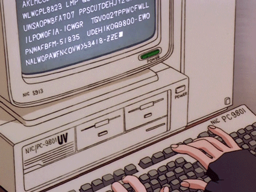

  
  <h1 align="center">
     Olá,  Bem vindo-a minha página!  Sou a 
      <a href="https://www.linkedin.com/in/edududuribeiro/](https://www.linkedin.com/in/ch%C3%A9riman-souza-/">Chériman Souza 😃️</a>
  </h1>
  ⭐️ Sobre mim:

   
  <em>
      
    
  </em>

  
- 📚 Formada em técnico de informática, graduando em Ciências da Computação 2º semestre
- 🌱  Atualmente tenho conhecimentos em software, hardware e redes/segurança da informação. Visando em um futuro próximo, contribuir para os desenvolvimentos de sistemas, garantindo a segurança ponta a ponta. Sou entusiasta à tecnologia, com amor por cibersegurança. 

   
 
    
      <h1 align="center">Hard skills ⭐️  </h1>

 

  
  
  
   <!-- -->
   

  
    
  
    
   
  
  
 Em aprendizagem 

  

 
    
<h1>

  

</h1>

  
  

<h1>

 
   
  

</h1>
